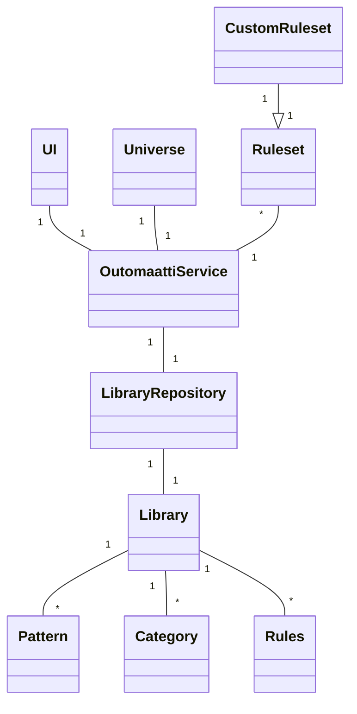

# Arkkitehtuuri

- Oheinen luokkakaavio kuvastaa meneillään olevan refaktoroinnin jälkeistä tilannetta. Viikon 4 arviointia tehtäessä näitä muutoksia voi tarkastella branchissa ["viikko5"](https://github.com/Aurala/ot-harjoitustyo/tree/viikko5).
- UI-luokassa oleva toteutus on tarkoitus jakaa useampaan alaluokkaan (mm. Menu, Visualization), mutta tämä edellyttää tarkempaa perehtymistä Pygameen.
