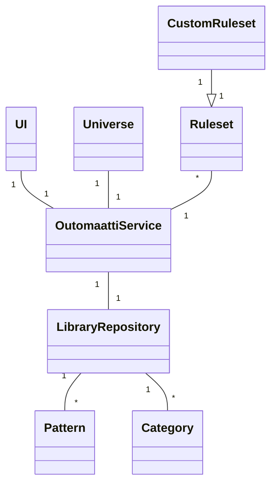
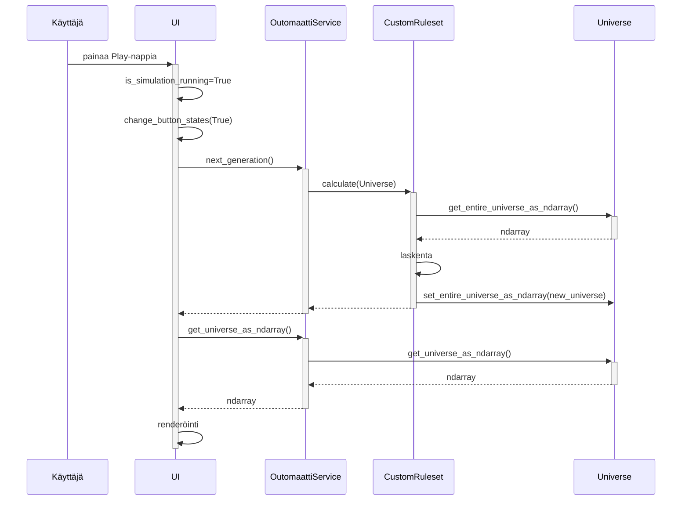

# Arkkitehtuuri (alustava)

## Rakenne

Olennaiset osat kuvattu hakemistorakenteen muodossa:

```
├── src
│   ├── entities
│   ├── repositories
│   │   ├── importers
│   ├── rules
│   ├── services
│   ├── ui
│   │   ├── resources
│   ├── index.py
│   ├── database_connection.py
│   └── initialize_database.py
├── data
├── outomaatti.db
└── outomaatti.toml
````

- entities: tietokohteita sisältäviä luokkia
- repositories: yksi luokka, joka huolehtii tietojen pysyväistallennuksesta
    - importers: luokkia, joita repository käyttää apuna, esim. lukemaan jotain tiettyä tiedostoformaattia
- rules: luokkia, jotka toteuttavat erilaisia soluautomaattisääntöjä; voi vaihtaa sovelluksessa
- services: yksi luokka, joka hoitaa sovelluksen toimintalogiikan
- ui: yksi luokka, joka hoitaa sovelluksen käyttöliittymän
    - resources: käyttöliittymän resurssitiedostoja, mm. fonttitiedosto, joka tarjoaa ikonit kontrolleihin
- index.py: käynnistää graafisen käyttöliittymän
- database_connection.py: tietokantayhteyden määrittävä tiedosto
- initialize_database.py: tietokannan alustava ja populoiva tiedosto
- data: hakemisto, jossa on RLE-muodossa olevia kuvioita tuotavaksi sovellukseen; osa tuodaan automaattisesti tietokannan alustuksen yhteydessä
- outomaatti.db: SQLite-tietokanta
- outomaatti.toml: sovelluksen konfiguraatiotiedosto

## Käyttöliittymä

Käyttöliittymä on toteutettu Pygamella. Se käsittää yhden päänäkymän, jonka päälle tuodaan tietyissä tapauksissa alinäkymiä ponnahdusikkunoina:

- Lyhyet ohjeet sovelluksen käyttäjälle
- Kuviotiedostojen tuonti sovelluksen
- Kuviotiedostojen selaus
- Asetukset

Käyttöliittymä on pyritty eristämään täysin sovelluslogiikasta, joka on OutomaattiService-luokassa. _Tämä toteutuu viikon 6 jälkeen vielä [puutteellisesti](#ohjelman-rakenteessa-tiedetyt-ongelmat)._

## Sovelluslogiikka

Toiminnallisista kokonaisuuksista vastaa luokka OutomaattiService.

OutomaattiServicen ja ohjelman muiden osien välisiä suhteita kuvataan alla:



## Tietojen pysyväistallennus

Pakkauksen `repositories` luokka `LibraryRepository` huolehtii tietojen tallettamisesta ja lukemisesta.

Luokan `LibraryRepository` pääasiallisena tietovarastona toimii paikallisella levyllä sijaitseva SQLite-tietokanta, mutta se osaa myös käyttää pakkauksen `importers` luokkaa `RLE` lukemaan tiedostoista [RLE-formaatissa](https://conwaylife.com/wiki/Run_Length_Encoded) tallennettuja kuvioita.

Muu osa sovelluksesta ei ole tietoinen tietokannasta tai tiedostoista.

_Em. toteutuu viikon 6 jälkeen vielä [puutteellisesti](#ohjelman-rakenteessa-tiedetyt-ongelmat)._

## Päätoiminnallisuudet

Sovelluksen toimintaa kuvataan [käyttöohjeessa](kayttoohje.md).

Oheinen sekvenssikaavio kuvaa mitä tapahtuu kun käyttäjä sovelluksen avattuaan painaa Play-nappia. Tässä vaiheessa:
- UI on luonut OutomaattiService-olion.
- OutomaattiService-olio on luonut Universe-olion, joka kuvaa x*y-kokoista soluautomaattia.
- UI on lisännyt muutamia testikuvioita OutomaattiServiceä käyttäen Universeen.



## Ohjelman rakenteessa tiedetyt ongelmat

Seuraavia ongelmia tullaan ratkomaan kurssin viimeisten viikkojen aikana:

- Luokassa `UI` on liikaa koodia
    - Toiminnallisuuden jakaminen useampaan luokkaan
    - Menun/kontrollien generointi esim. sanakirjassa olevan tiedon perusteella
    - Yksi tapahtumankäsittelijä menu-eventeille
    - Kaiken siirrettävissä olevan logiikan siirto luokkaan `OutomaattiService`
- Luokka Universe ei kuulu pakettin `entities`
- Kaikille "LifeLike"-algoritmeille yhteisen logiikan siirtäminen luokista `Life` ja `HighLife` luokkaan `Ruleset`
- LibraryRepositoryn ulkopuolella käsitellään tiedostoja
    - Tiedostojenkäsittelyn siirtäminen luokasta `repositories.importers.RLE` tähän luokkaan; RLE-luokka lukee jatkossa kuvioita sille annetusta tekstimuotoisesta sisällöstä (samalla `importers` --> `decoders`)
    - Tietokannanluontiskriptin siirtäminen käyttämään RLE-decoderia `LibraryRepository`:n kautta
