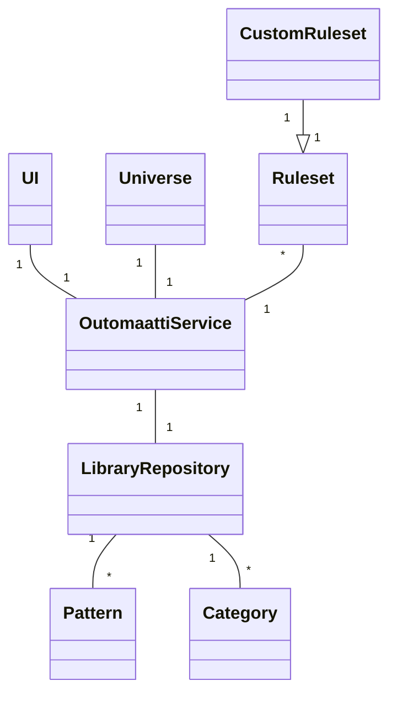
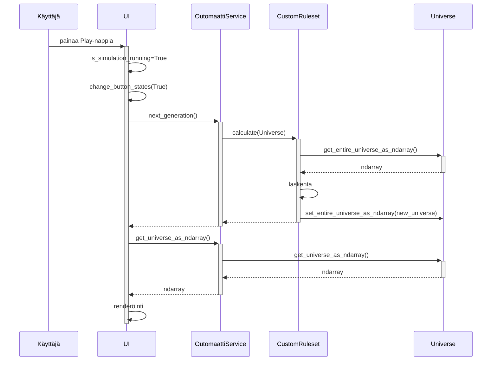

# Arkkitehtuuri (alustava)

## Rakenne

## Käyttöliittymä

Käyttöliittymä on toteutettu Pygamella. Se käsittää yhden päänäkymän, jonka päälle tuodaan tietyissä tapauksissa näkymiä ponnahdusikkunoina:

- Lyhyet ohjeet sovelluksen käyttäjälle
- Kuviotiedostojen tuonti sovelluksen
- Kuviotiedostojen selaus
- Asetukset

Käyttöliittymä on pyritty eristämään täysin sovelluslogiikasta, joka on OutomaattiService-luokassa.

## Sovelluslogiikka

xxx

## Päätoiminnallisuudet

## xxx

Oheinen sekvenssikaavio kuvaa mitä tapahtuu kun käyttäjä sovelluksen avattuaan painaa Play-nappia. Tässä vaiheessa:
- UI on luonut OutomaattiService-olion.
- OutomaattiService-olio on luonut Universe-olion, joka kuvaa x*y-kokoista soluautomaattia.
- UI on lisännyt muutamia testikuvioita OutomaattiServiceä käyttäen Universeen.

## Tietojen pysyväistallennus

Pakkauksen `repositories` luokka `LibraryRepository` huolehtii tietojen tallettamisesta tietokantaan (SQLite) ja tietojen lukemisesta tiedostoista.

Luokka `LibraryRepository` osaa myös käyttää pakkauksen `importers` luokkaa `RLE` lukemaan tiedostosta RLE-formaatissa tallennettuja kuvioita.

Muu osa sovelluksesta ei ole tietoinen tietokannasta tai tiedostoista.

_(Tilanne ei ole viikolla 6 ihan täydellisesti kuvatun kaltainen, kts. [loppupalautukseen mennessä korjattavat asiat](#ohjelman-rakenteessa-tiedetyt-ongelmat))._

## Ohjelman rakenteessa tiedetyt ongelmat

Seuraavia ongelmia tullaan ratkomaan kurssin viimeisten viikkojen aikana:

- Käyttöliittymässä on liikaa koodia
    - Toiminnallisuuden jakaminen useampaan luokkaan
    - Menun/kontrollien generointi esim. sanakirjassa olevan tiedon perusteella
    - Yksi tapahtumankäsittelijä menu-eventeille
    - Siirrettävissä olevan logiikan siirto OutomaattiServiceen
- LibraryRepositoryn ulkopuolella käsitellään tiedostoja
    - Tiedostojenkäsittelyn siirtäminen luokasta `repositories.importers.RLE` tähän luokkaan
    - Tietokannanluontiskriptin siirtäminen käyttämään RLE-importeria LibraryRepositoryn kautta
