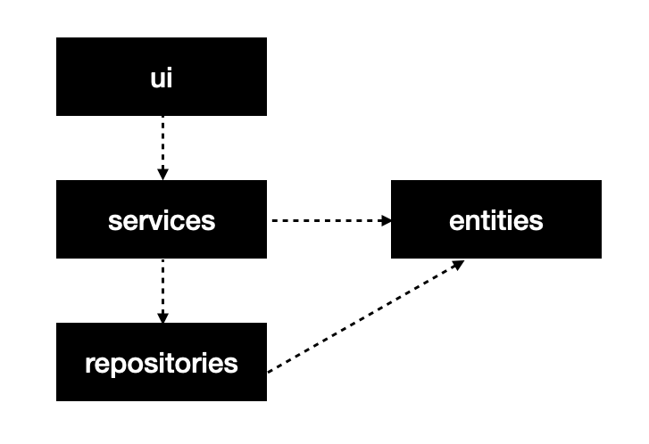
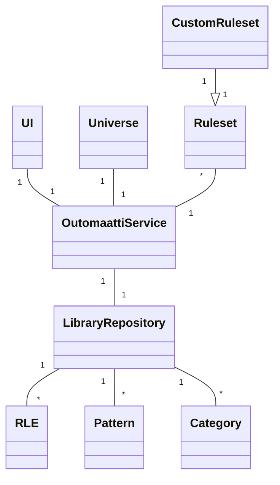
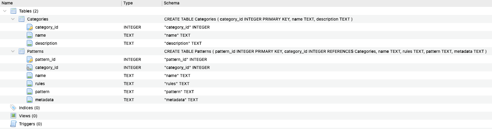
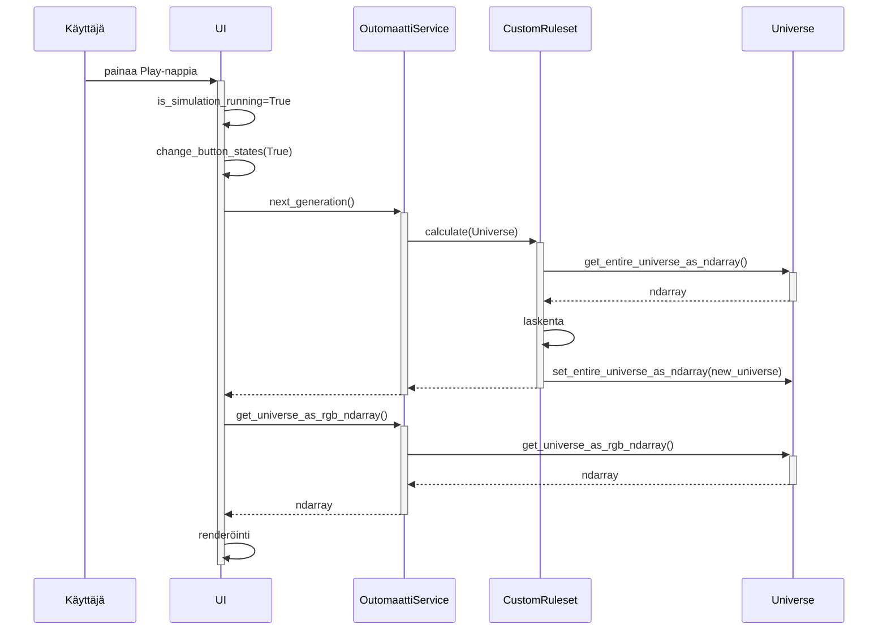

# Arkkitehtuuri

## Rakenne

Ohjelman rakenne noudattaa kolmitasoista kerrosarkkitehtuuria:



Sovelluksen olennaiset osat kuvattu hakemistorakenteen muodossa:

```
├── src
│   ├── entities
│   ├── repositories
│   │   ├── importers
│   ├── rules
│   ├── services
│   ├── ui
│   │   ├── resources
│   ├── index.py
│   ├── database_connection.py
│   └── initialize_database.py
├── data
├── outomaatti.db
└── outomaatti.toml
````

- `entities`: tietokohteita sisältäviä luokkia
- `repositories`: yksi luokka, joka huolehtii tietojen pysyväistallennuksesta
    - `decoders`: nyt yksi luokka (`RLE`), jota `LibraryRepository` käyttää lukemaan RLE-tiedostoformaattia
- `rules`: luokkia, jotka toteuttavat erilaisia soluautomaattisääntöjä ja joita voi vaihtaa dynaamisesti sovelluksessa
- `services`: nyt yksi luokka (`OutomaattiService`), joka hoitaa sovelluksen toimintalogiikan
- `ui`: luokka (`UI`), joka luo sovelluksen käyttöliittymän
    - `components`: UI-toiminnallisuutta palasteltuna pienempiin kokonaisuuksiin
    - `resources`: käyttöliittymän resurssitiedostoja (kuvia, ikonifontit)
- `index.py`: käynnistää graafisen käyttöliittymän
- `database_connection.py`: tietokantayhteyden määrittävä tiedosto
- `initialize_database.py`: tietokannan alustava ja populoiva tiedosto
- `data`: hakemisto, jossa on RLE-muodossa olevia kuvioita; tuodaan automaattisesti tietokannan alustuksen yhteydessä
- `outomaatti.db`: SQLite-tietokanta
- `outomaatti.toml`: sovelluksen konfiguraatiotiedosto

## Käyttöliittymä

Käyttöliittymä on toteutettu Pygamella, käyttäen `pygame_menu`-kirjastoa. Se käsittää yhden päänäkymän, jonka päälle tuodaan tietyissä tapauksissa alinäkymiä ponnahdusikkunoina:

- Lyhyet ohjeet sovelluksen käyttäjälle
- Kuviotiedostojen selaus
- Asetukset
- Konfirmaatiodialogit
- Popup-viestit

Käyttöliittymä on pyritty eristämään sovelluslogiikasta, joka on OutomaattiService-luokassa.

## Sovelluslogiikka

Toiminnallisista kokonaisuuksista vastaa luokka `OutomaattiService`.

Luokan `OutomaattiService` ja ohjelman muiden osien välisiä suhteita kuvataan alla:



Yo. kuvassa ei selkeyden takia näy käyttöliittymäkomponentit, joita alustetaan luokassa `UI`.

- `Menu`
- `Confirmation`
- `Info`
- `Status`
- `Simulation`
- `Theme`
- `Settings`
- `Popup`
- `PatternPicker`

Refaktoroinnista huolimatta käyttöliittymäkomponenttien väliset riippuvuudet eivät ole täysin selkeät. Kts. [alle](#ohjelman-rakenteessa-tiedetyt-ongelmat).

## Tietojen pysyväistallennus

Pakkauksen `repositories` luokka `LibraryRepository` huolehtii tietojen tallettamisesta ja lukemisesta.

Luokan `LibraryRepository` pääasiallisena tietovarastona toimii paikallisella levyllä sijaitseva SQLite-tietokanta. Tietokantatiedoston nimi määritetään konfiguraatiotiedostossa. Testeihin käytetyt Invoke-taskit ohittavat tämän asetuksen ja luovat testitietokannan `outomaatti-test.db`.

Tietokanta käsittää kaksi taulua:



Luokka käsittelee tiedostoja kahdella tavalla:

1. Luokka lukee ja purkaa kuvioita tiedostoista, jotka tuodaan käyttöliittymään drag and droppaamalla käyttöliittymään. Tällä hetkellä pakkauksessa `decoders` on luokka `RLE`, jolla luetaan [RLE-formaatissa](https://conwaylife.com/wiki/Run_Length_Encoded) tallennettuja kuvioita. Tuodut tiedostot tallennetaan tietokannan tauluun `Patterns`.
2. Luokka tallettaa `pygame.Surface`-olioista PNG-tiedostoihin.

Muu osa sovelluksesta ei ole tietoinen tietokannasta tai tiedostoista. Sovelluksen käyttämää tietokantaa tai muuta tallennustapaa on mahdollista muuttaa helposti.

## Päätoiminnallisuudet

Sovelluksen toimintaa kuvataan [käyttöohjeessa](kayttoohje.md).

Oheinen sekvenssikaavio kuvaa mitä tapahtuu kun käyttäjä sovelluksen avattuaan painaa Play-nappia. Tässä vaiheessa:
- `UI` on luonut `OutomaattiService`-olion.
- `OutomaattiService`-olio on luonut `Universe`-olion, joka kuvaa x*y-kokoista soluautomaattia.
- `UI` on lisännyt testikuvion luokkaa `OutomaattiService` käyttäen Universeen.



## Ohjelman rakenteessa tiedetyt ongelmat

Seuraavia ongelmia tullaan ratkomaan kurssin viimeisten viikkojen aikana:

- UI on refaktoitu useampaan luokkaan (komponenttiin), mutta riippuvuudet eivät ole niin selkeitä kuin oli tavoitteena.
    - Jälkiviisaana on helppo todeta:
        - UI olisi ollut parempi tehdä Tkinterillä. Aluksi käyttöön suunniteltu `Pygame GUI`-kirjasto osoittautui bugiseksi ja vaihtoehtoinen kirjasto `pygame_menu` ei taipunut tarkoitukseen. Se monimutkaisti arkkitehtuuria.
        - Pygamen event-mallia olisi pitänyt tutkia. Potentiaalisesti se olisi mahdollistanut käyttöliittymäarkkitehtuurin selkeyttämisen niin, että käyttöliittymäluokat eivät kutsuisi toinen toisiaan.
- Luokka Universe ei välttämättä kuuluisi pakettin `entities`.
