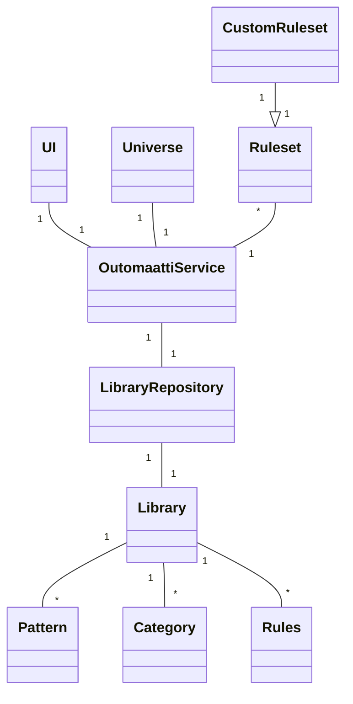
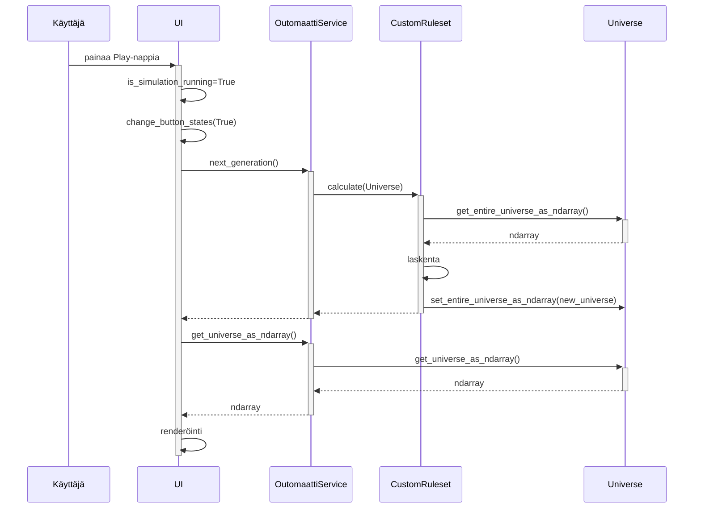

# Arkkitehtuuri

Kommentti liittyen luokkakaavioon: UI-luokassa oleva toteutus on tarkoitus jakaa useampaan alaluokkaan (mm. Menu, Visualization), mutta tämä edellyttää tarkempaa perehtymistä Pygameen viimeisten viikkojen aikana.

Oheinen sekvenssikaavio kuvaa mitä tapahtuu kun käyttäjä sovelluksen avattuaan painaa Play-nappia. Tässä vaiheessa:
- UI on luonut OutomaattiService-olion.
- OutomaattiService-olio on luonut Universe-olion, joka kuvaa x*x-kokoista soluautomaattia.
- UI on lisännyt muutamia testikuvioita OutomaattiServiceä käyttäen Universeen.

Olen pitänyt tähän asti yhden sukupolven laskennan ja sen hakemisen renderöitäksi erillisinä toimintoina. Tämän voisi toki muuttaa niin, että data palautetaan next_generation()-kutsussa.

OutomaattiService voisi ehkä myös välittää ndarray:n laskentaa hoitavalle luokalle (ja takaisin). Ajatus oli, että tulevaisuuden CustomRuleset-luokissa olisi sellaista monimutkaista toiminnallisuutta, joka vaatisi pääsyä Universe-luokan metodeihin.
