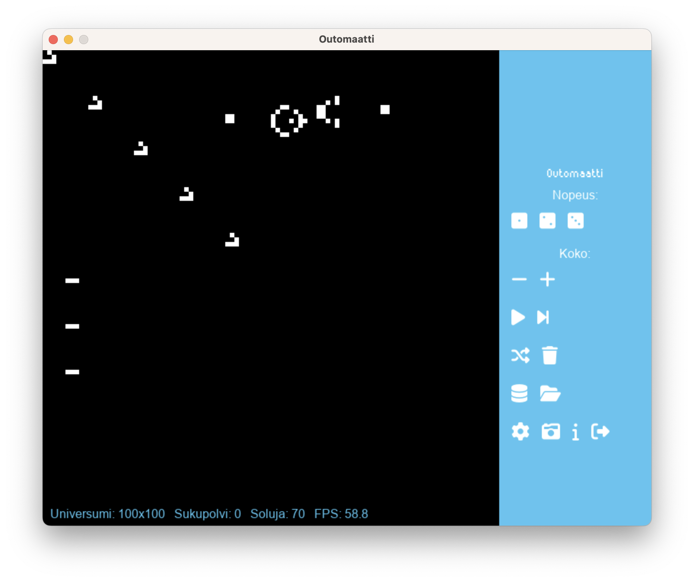
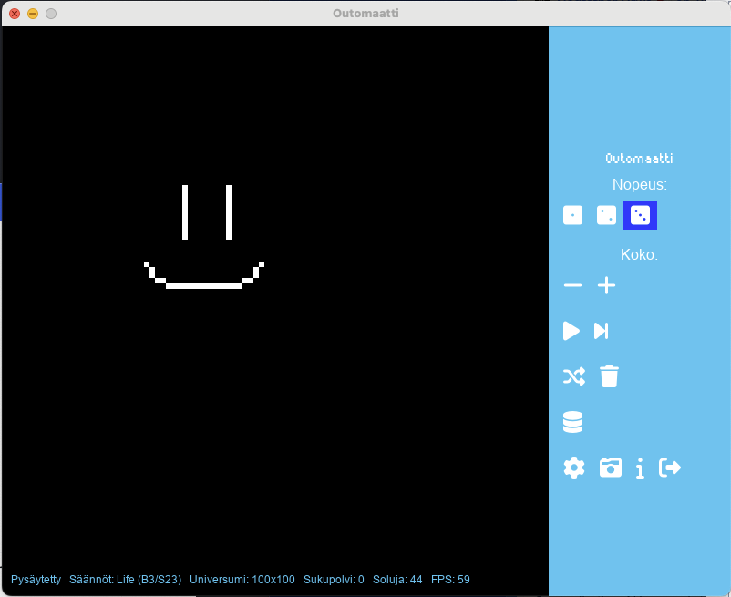

# Käyttöohje (alustava)

## Ohjelman käynnistäminen

Ennen ohjelman käynnistämistä muodostetaan ohjelman käyttämä tietokanta komennolla:

```
poetry run invoke build
```

Tässä vaiheessa tietokantaan tuodaan valmiiksi kuvioita, joita voidaan käyttää käyttöliittymän kautta.

Ohjelma käynnistyy komennolla:

```
poetry run invoke start
```

## Käyttöliittymä

### Käyttöliittymäelementit



Alue 1. Soluautomaatti. Solujen elämää ja kuolemaa seurataan tässä.

Kuvioiden piirtämiseen soluautomaattiin hiirellä ei tarvitse tehdä työkaluvalintaa. Riittää kun kliksuttelee hiirellä haluttuja kohtia soluautomaatissa kun simulaatio ei ole käynnissä. Hiiren vasen nappi kääntää kursorin kohdalla olevan solun tilan päinvastaiseksi.

Kuvioiden tuonti ohjelmaan toimii drag and drop -menetelmällä. Eli käyttäjä voi vetää [RLE-muotoisia](https://conwaylife.com/wiki/Run_Length_Encoded) tiedostoja Outomaatti-ikkunaan. Tuodut kuviot löytyvät selaustoiminnolla (krs. alle).

RLE-muotoisia kuvioita löytää esim. [täältä](https://conwaylife.com/wiki/Category:Patterns).

Huomio: RLE-formaatti on määritelty laveasti ja erilaiset ohjelmat tuottavat hieman toisistaan poikkeavia formaatteja. Outomaatti ei (vielä ainakaan) kelpuuta kaikkia RLE-tiedostoja.

Alue 2. Soluautomaatin alapuolella on statuspalkki, johon päivittyy tietoja:
- Simulaation status (käynnissä / pysäytetty)
- Käytössä olevat säännöt
- Universumi koko
- Meneillään oleva sukupolvi
- Kuinka monta solua simulaatiossa on elossa
- Ruudunpäivitystaajuus (FPS)

Alue 3. Menu. Täällä on erilaisia toimintoja käyttäjälle. Käydään ne läpi ylhäältä alas ja vasemmalta oikealle:

- Nopeudensäätö
    - 1 = nopea, 2 = keskinopea, 3 = hidas.
- Koko
    - Miinus pienentää Universumia 10 ruutua korkeus- ja leveyssuunnassa
    - Plussa vastaavasti kasvattaa Universumia 10 ruutua korkeus- ja leveyssuunnassa
    - Universumin oletuskoko on 100 x 100 ruutua
    - Universumin minimikoko on 10 x 10 ruutua
    - Edellä olevia arvoja voi muuttaa konfiguraatiotiedostossa
    - Huomaathan, että laskenta hidastuu merkittävästi Universumin kasvaessa, joten ole varovainen arvojen suhteen
        - Sovelluksessa on paljon optimointivaraa, jos into riittää koodaamiseen (#haaste)
- Play/Pause
    - Käynnistää/pysäyttää simulaation
- Random
    - Tuo Universumiin sattumanvaraisen kuvion tietokannasta, sattumanvaraiseen paikkaan
- Roskis
    - Tyhjentää Universumin ja nollaa sukupolvilaskurin
- Selaus
    - Antaa käyttäjän selata tietokantaan tallennettuja kuvioita
    - Valitun kuvion voi tuoda Universumiin
        - Kun valinta on tehty ja dialogi on sulkeutunut, kuvion voi asettaa klikkaamalla hiirellä haluttua kohtaa (vastaa kuvion vasenta yläkulmaa)
- Asetukset
    - Käyttäjän voi säätää asetuksia
    - Tällä hetkellä asetuksia on ainoastaan yksi: soluautomaatin käyttämät säännöt
        - Sääntöjä Outomaatin mukana tulee kahdet:
            - John Conway'n alkuperäiset Game of Life -säännöt (B3/S23)
            - HighLife-variaatio (B36/S23)
        - Lisää sääntöjä voi kirjoittaa CustomRuleset-luokkia hyväksi käyttämällä (#haaste)
- Kamera
    - Tallentaa kuvan Universumista tiedostoon
        - Tiedostonimeksi muodostuu aikaleima, kuvaformaatti on PNG, hakemiston voi määrittää konfiguraatiotiedostossa
- Info
    - Avaa inforuudun, jossa _hieman_ ohjeita
- Exit
    - Sulkee sovelluksen


Kontrollit ovat Pause-nappia lukuunottamatta pois käytöstä simulaation ollessa käynnissä.



Kuvassa Universumi on tyhjennetty ja käyttäjä on piirtänyt siihen mielentilaansa kuvaavan kuvion hiirellä:

## Konfigurointi

Konfiguraatioiden muokkaaminen ei ole pakollista sovelluksen käyttämiseksi. Tarvittaessa sovelluksen konfiguraatiot löytyvät tiedostosta `outomaatti.toml`. 

Asetukset on jaoteltu seuraaviin ryhmiin:

- resources
    - Sovelluksen käyttämien tiedostojen sijainteja
    - Sovelluksen tuottamien tiedostojen tallennushakemistot
- ui
    - Graafisen käyttöliittymän oletusasetukset
    - Graafisen käyttöliittymän visuaalinen ilme (värit, fontit)
- rules
    - Listaus luokista, joita käyttäjän on mahdollista käyttää
