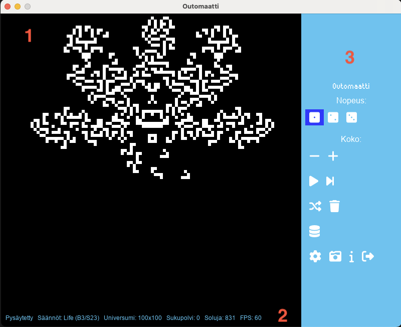

# Käyttöohje (alustava)

## Ohjelman käynnistäminen

Ennen ohjelman käynnistämistä muodostetaan ohjelman käyttämä tietokanta komennolla:

```
poetry run invoke initdb
```

Tietokantaan tallennetaan valmiiksi ohjelmaan tuotuja kuvioita, joita voidaan käyttää käyttöliittymän kautta.

Ohjelma käynnistyy komennolla:

```
poetry run invoke start
```

## Käyttöliittymä

_Huomio: Käyttöliittymän kuvat ovat keskeneräisestä versiosta._

### Käyttöliittymäelementit



Musta alue on soluautomaatti. Solut elävät ja kuolevat Universumissa, jota tämä alue edustaa.

Soluautomaatin alapuolella on statuspalkki, johon päivittyy tietoja:
- Simulaation status (jos käynnissä)
- Simulaation (Universumi) koko
- Sukupolvi
- Kuinka monta solua simulaatiossa on elossa
- Ruudunpäivitystaajuus (FPS)

Oikeassa reunassa on kontrolleja. _Kuva ei edusta lopullista sovellusta - kontrollien määrä tulee päivittymään._

Kontrollit:
- Nopeus 1-3 _(ei toiminnassa vielä)_
- Koko, muttaa Universumin kokoa _(ei toiminnassa vielä)_
    - Miinus pienentää Universumia viisi ruutua
    - Plus kasvattaa Universumia viisi ruutua
    - Minimikoko on 5x5, maksimikoko on oletusarvoisesti 100x100 (laskenta hidastuu merkittävästi Universumin kasvaessa)
- Play/Pause, käynnistää/pysäyttää simulaation
- Shuffle, tuo Universumiin sattumanvaraisen kuvion tietokannasta sattumanvaraiseen paikkaan
- Roskis, tyhjentää Universumin
- Tietokanta, antaa käyttäjän selata ja lisätä tietokantaan tallennettuja kuvioita Universumiin _(ei toiminnassa vielä)_
- Tiedosto, antaa käyttäjän selata tiedostoja ja tuoda RLE-muotoon tallennetun kuvan sovellukseen _(ei toiminnassa vielä)_
- Asetukset, antaa käyttäjän säätää asetuksia _(ei toiminnassa vielä)_
    - Luokka, joka tarjoaa laskentaan käytettävät säännöt
- Kamera, tallentaa nykyisen Universumin tiedostoon
- Info, avaa ohjeet _(ei toiminnassa vielä)_
- Exit, sulkee sovelluksen

Kontrollit ovat Pause-nappia lukuunottamatta pois käytöstä simulaation ollessa käynnissä:


Kuvassa Universumi on tyhjennetty ja käyttäjä on piirtänyt siihen mielentilaansa kuvaavan kuvion hiirellä:


Piirtämiseen ja pyyhkimiseeen ei tarvita erillisen työkalun valintaa. Riittää kun kursori tuodaan alueelle. Hiiren vasen nappi kääntää kursorin kohdalla olevan solun tilan päinvastaiseksi.

## Konfigurointi

Konfiguraatioiden muokkaaminen ei ole pakollista sovelluksen käyttämiseksi. Tarvittaessa sovelluksen konfiguraatiot löytyvät tiedostosta `outomaatti.toml`. 

Asetukset on jaoteltu seuraaviin ryhmiin:

- resources
    - Sovelluksen käyttämien tiedostojen sijainteja
    - Sovelluksen tuottamien tiedostojen tallennushakemistot
- ui
    - Graafisen käyttöliittymän oletusasetukset
    - Graafisen käyttöliittymän visuaalinen ilme (värit, fontit)
- rules
    - Listaus luokista, joita käyttäjän on mahdollista käyttää
