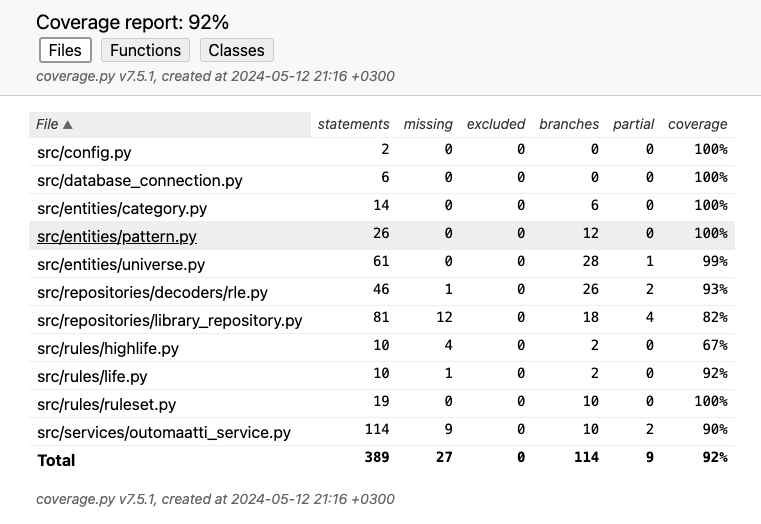

# Testausdokumentti

Ohjelmaa on testattu sekä automaattisin yksikkö- ja integraatiotestein sekä manuaalisesti tehdyillä järjestelmätason testeillä.

## Yksikkö- ja integraatiotestaus

### Sovelluslogiikka

Sovelluslogiikasta vastaavaa `OutomaattiService`-luokkaa testataan TestOutomaattiService-luokalla. Testeissä on huomioitu, että ne testaavat useiden luokkien yhteistoimintaa.

### Repositorioluokat

Repositorioluokkaa `LibraryRepository` testataan ainoastaan testeissä käytettävällä tietokannalla. Testauksen alussa tietokanta alustetaan ja sinne viedään `initialize_database.py`-tiedostossa määriteltytä sisältöä (12 kpl kategorioita ja 49 RLE-tiedostoista luettua kuviota). Testitietokannan nimi annetaan testauksesta huolehtiville tehtäville `tasks.py`-tiedostossa eli nk. dotenv-tiedostoja ei käytetä.

### Testauskattavuus

Testauksen haarautumakattavuus on kokonaisuudessaan 92%.

Testauksen haarautumakattavuus ei sisällä käyttöliittymäkerrosta.

Luokka `HighLife` (`highlife.py`) jää alle vaaditun 70%:n. Luokka on vaihtoehtoinen luokalle `Life` (`life.py`), jota Outomaatti käyttää oletusarvoisesti. En keksinyt miten olisin saanut sitä testattua automaattisesti niin, että vastaavasti luokan `Life` haarautumakattavuus ei olisi laskenut. Voisin luonnollisesti poistaa luokan sovelluksesta, mutta siinä tapauksessa joutuisin poistamaan merkittävän toiminnallisuuden (mahdollisuuden ladata dynaamisesti simulaatiosääntöjä toteuttavia luokkia).

## Järjestelmätestaus

Sovelluksen järjestelmätestaus on suoritettu manuaalisesti kehitysympäristössä (macOS 14.4.1) että Helsingin yliopiston Cubbli Linux -virtuaalikoneissa. Testaus on tehty pääosin Python-versioilla 3.10 ja 3.11.

Muistivuotojen yms. hankalasti löydettävien ongelmien vuoksi testauksessa simulaatiota ajettiin yhtäjaksoisesti 24 tuntia, jonka aikana simulaatio eteni n. 2,5 miljoonaa sukupolvea. Ongelmia ei esiintynyt. Muistinkulutus oli testijakson jälkeen samalla tasolla kuin testin alkaessa.

## Toiminnallisuudet

Kaikki [määrittelydokumentin](vaatimusmaarittely.md) ja [käyttöohjeen](kayttoohje.md) kuvaamat toiminnallisuudet on testattu.

## Tiedossa olevat laatuongelmat

- Sovellus ei pysty lukemaan kaikkia mahdollisia (huonosti määritellyn) RLE-formaatin variaatioita. Eikä se tarkista onko `.rle`-päätteinen tiedosto todella RLE-tiedosto.
