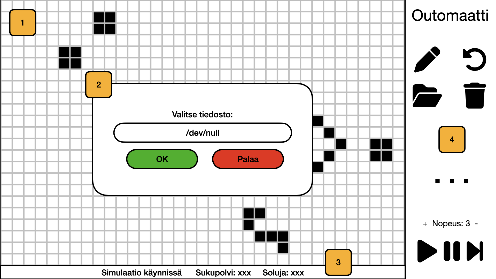

# Vaatimusmäärittely sovellukselle Outomaatti

## Sovelluksen tarkoitus

Outomaatti-sovellus toteuttaa [soluautomaatin](https://fi.wikipedia.org/wiki/Soluautomaatti). Oletusarvoina sovelluksessa on John Conway'n kehittämän [Game of Lifen](https://fi.wikipedia.org/wiki/Game_of_Life) säännöt (B3/S23), mutta sovellus tarjoaa mahdollisuuden sääntöjen parametrien muuttamiseen.

Sovellusta voidaan käyttää viihdyttävänä ajanvietteenä tai opetuskäytössä, esimerkiksi innostamaan lapsia matematiikan opiskeluun tai jopa tuottamaan Python-koodia (omien sääntöjen kirjoittaminen).

## Käyttäjät

Ohjelmisto on suunniteltu yhdelle käyttäjälle.

## Käyttöliittymäluonnos

Käyttöliittymäelementit korkealla tasolla:

1. Ruudukko visualisoi maailman, jossa solut elävät. Käyttäjä voi piirtää vapaasti kuvioita tähän ruutuun sovelluksen työkaluilla (minimissään kynä, pyyhekumi). Käyttäjä voi myös tuoda netistä löytämiään solukuvioita.
2. Työkalut avaavat popup-ikkunoita, mm. tiedostojen tuomiseksi tai asetusten muuttamiseksi.
3. Infopalkki kertoo simulaation tilanteen.
4. Käyttäjän käytettävissä olevat työkalut.

Graafisten elementtien lähteet:
- Symbolit: Font Awesome 6.5.1, [The SIL Open Font License 1.1](https://openfontlicense.org/)
- Taustalla oleva ruudukko: By Liambdonegan01 - Own work, CC0, https://commons.wikimedia.org/w/index.php?curid=89161559

## Ei-toiminnalliset vaatimukset

- Sovellus toimii (vähintään) Linux- ja macOS-käyttöjärjestelmillä varustetuissa koneissa.
- Sovellus ajetaan paikallisen koneen tiedostojärjestelmässä sijaitsevasta kansiorakenteesta.
- Sovelluksen konfiguraatiotiedostot ja SQLite-tietokanta sijaitsevat em. kansiorakenteessa.
- Sovelluksen oletusasetukset määritetään konfiguraatiotiedostossa.
- Sovelluksen visuaalinen ilme määritetään konfiguraatiotiedostossa.
- Sovelluksen arkkitehtuuri tukee mahdollisuutta lisätä rinnakkaisia funktioita, jotka toteuttavat sääntöjä, jotka eivät ole toteuttavissa perustoiminnallisuutta parametrisoimalla.
- Sovelluksen toteutus (ml. dokumentaatio) noudattaa kaikkia kurssin [ohjeistuksia](https://ohjelmistotekniikka-hy.github.io/python/toteutus).
- Sovelluksen koodi täyttää kurssin asettamat [laatuvaatimukset](https://ohjelmistotekniikka-hy.github.io/python/koodin-laatuvaatimukset).

## Toiminnallisuus

- Tehty: Käyttäjä voi muuttaa kanvaasin kokoa.
- Tehty: Käyttäjä voi piirtää soluja kanvaasille.
- Tehty: Käyttäjä voi pyyhkiä soluja kanvaasilta.
- Tehty (tiedostosta): Käyttäjä voi tuoda sovellukseen (tallentuvat tietokantaan) solukuvioita [RLE-muodossa](https://conwaylife.com/wiki/Run_Length_Encoded) olevasta tiedostosta tai copy-pastesta.
- Tehty: Käyttäjä voi lisätä sovellukseen tuomiaan solukuvioita kanvaasille.
- Tehty: Käyttäjä voi käynnistää simulaation.
- Tehty: Käyttäjä voi säätää simulaation nopeutta.
- Tehty: Käyttäjä voi pysäyttää simulaation.
- Tehty: Käyttäjä voi edetä simulaatiossa eteenpäin yksi sukupolvi kerrallaan.
- Tehty: Simulaation ollessa pysäytettynä, käyttäjällä on mahdollisuus muokata kanvaasia (yllä mainituilla työkaluilla).
- Tehty: Käyttäjä voi seurata simulaation tilaa (sukupolvi, elossa olevien solujen määrä) infopalkista.
- Ei tehty: Käyttäjä voi määrittää, katoavatko kanvaasin reunan yli kulkevat solut vai ilmestyvätkö ne kanvaasin vastakkaiselta puolelta.
- Ei tehty: Käyttäjä voi muuttaa parametrejä, jotka annetaan funktiolle, joka päättää solujen syntymästä/kuolemasta/säilymisestä.

Paria viimeistä toiminnallisuutta kokeilin kehitysvaiheessa ja totesin ne huonoiksi ideoiksi. En toteuttanut loppuun. Vastaavasti ketterän ohjelmistokehityksen hengessä toteutin jatkokehitysideoiden listalta pari toiminnallisuutta.

## Jatkokehitysideoita ("backlog")

- Käyttäjä voi määrittää maksimikeston simulaatiolle.
- Käyttäjä voi valita useista erilaista piirtotyökaluista.
- Käyttäjä voi määrittää piirtovärin.
- Käyttäjä voi tuoda sovellukseen bittikarttoja, jotka muunnetaan solukuvioiksi.
- Käyttäjän sulkiessa sovelluksen, se tallentaa meneillään olevan simulaation tietokantaan.
- Tehty: Käyttäjä voi tallettaa tiedostoon yksittäisen kuvakaappauksen simulaatiosta.
- Tehty: Käyttäjä voi valita funktion, joka päättää solujen syntymästä/kuolemasta/säilymisestä.
- Käyttäjä voi tallettaa automaattisesti tiedostoon kuvakaappauksen jokaisesta sukupolvesta simulaation aikana.
- Käyttäjä voi tuoda kuvioita [eri formaateissa](https://conwaylife.com/wiki/File_formats) olevista tiedostoista.
- Visuaaliset parannukset.
