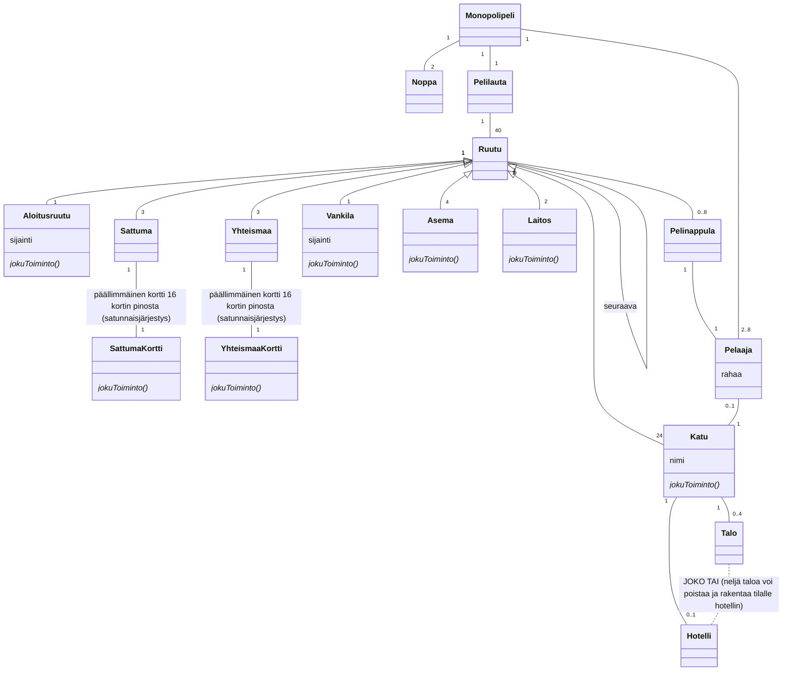

## Monopoli-pelin luokkakaavio

Lisätietoja harjoituksen tekemiseen löytyi:
- [Wikipediasta](http://fi.wikipedia.org/wiki/Monopoli_(peli))
- [Hasbron sivuilta löytyneestä sääntökirjasta](https://www.hasbro.com/common/documents/430e4f3f6bfd10148a8ef35124427085/D5C22B4250569047F56E08937DF18AB2.pdf)

Erilaisten ruutujen ja niihin liittyvien korttien lukumääriä osoittavissa merkinnöissä epävarmuutta. Toivottavasti meni edes jokseenkin oikein.